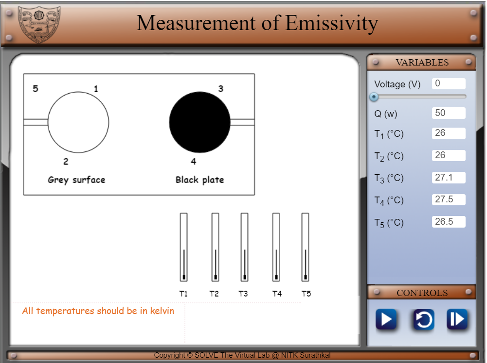
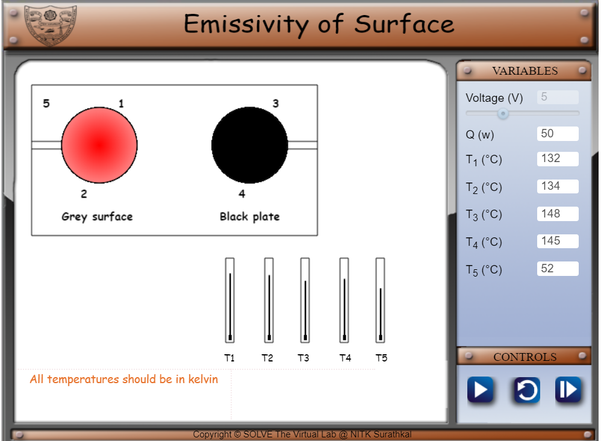

#### These procedure steps will be followed on the simulator

1. •	The following window appears after clicking on the simulation link.  
 

2. Click on play button and wait for 5 seconds to allow it to reach steady state. Note down the flow rates and four temperatures.. 
 

3. Click next. Verify your calculations by entering in the input boxes.
 

4. Redo the experiment if you wish to.
