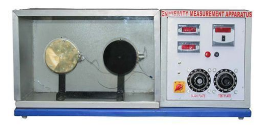
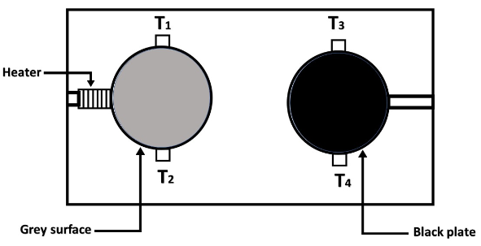

## INTRODUCTION
 

#### User Objectives and Goals:

1)To study properties of black body

2)To determine the emissivity of the test slab

#### Theory

When heat is supplied at a constant rate to a body, heat loss takes place by conduction, convection and radiation. If two bodies of the same geometry are heated under identical conditions as shown in Fig 1 and Fig 2, the heat loss by conduction and convection can be assumed to be same for both the bodies.

  
Fig 1. Experimental setup of Emmisivity measurement apparatus
  
Fig 2. Schematic representation of Emmisivity measurement apparatus

 The heat loss by radiation depends on:

Characteristic of the material 
Geometry of the surface 
Temperature of the surface 
Rate of heat loss to surrounding air by radiation is given by: 
Q=σA1(T1 4-T2 4) 
σ = Stefan-Boltzmann constant = -5.67×10-8 W/m2K4 
A1 = surface area (m2) 
ϵ1 = emissivity 
T1 = surface temperature of the body (K) 
T2 = surrounding atmospheric temperature (K)

#### Equations/formulas:

Temperature of the black body (K) 
Tb=[(T1+T2)/2]+273=

Temperature of the gray body (K) 
Tg=[(T3+T4)/2]+273=

Chamber air temperature (K) 
Ta= T5+273=

Emissivity of test plate (gray body) 
∈ = (Tb 4-Ta 4)/(Tg 4-Ta 4) =
